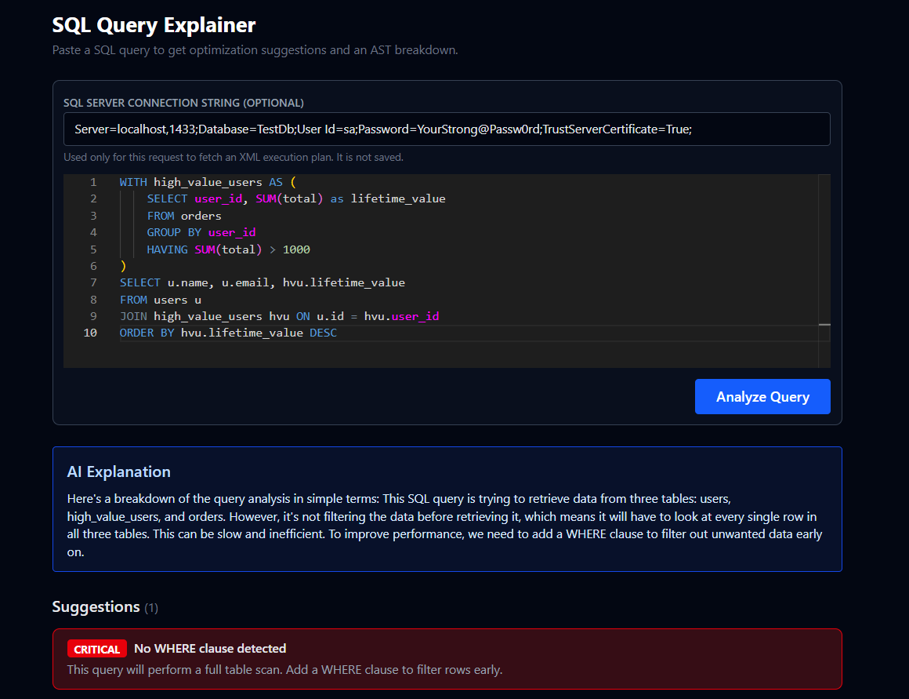
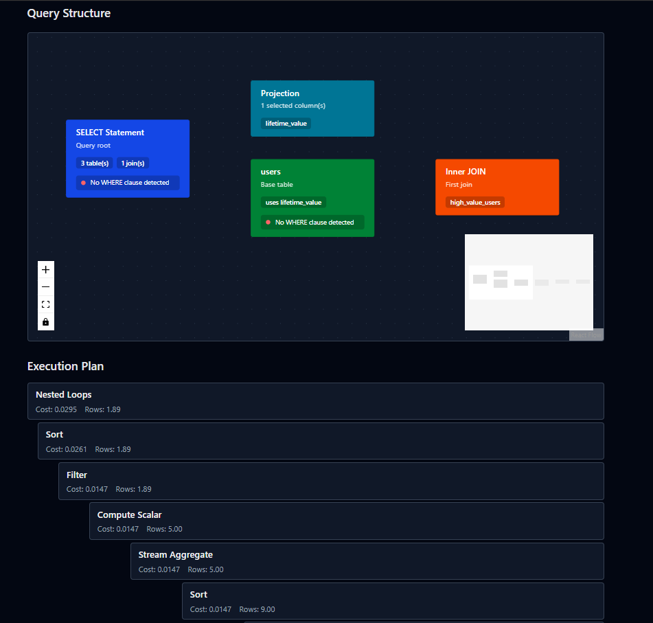

# SQL Query Explainer and Optimizer

A full-stack project that analyzes SQL queries, explains what they do in plain language, Show SQL query graph structure, highlights common optimization opportunities.





## What This Project Is

This project has two apps inside one repository:

- `SqlExplainer.API` (ASP.NET Core Web API)
- `sql-explainer-ui` (React + Vite frontend)

You paste a SQL query in the UI, send it to the API, and get:

- Parse validation (is SQL valid?)
- Structured query summary (tables, columns, joins, clauses)
- Rule-based suggestions (for example: `SELECT *`, missing `WHERE`, cartesian join risks)
- Optional execution plan (if a SQL Server connection string is provided)
- Optional AI explanation generated through Groq

## Tech Stack Used

### Backend (`SqlExplainer.API`)

- .NET 9 Web API
- `Microsoft.SqlServer.TransactSql.ScriptDom` for static SQL parsing/AST analysis
- `Microsoft.Data.SqlClient` for optional SQL Server execution plan retrieval
- `HttpClient` to call Groq chat-completions API

### Frontend (`sql-explainer-ui`)

- React 19 + TypeScript + Vite
- Monaco Editor for SQL editing
- Axios for API communication
- React Flow + Dagre for AST/summary graph visualization
- Tailwind CSS for styling

## Why It Is Useful

- Helps developers quickly understand unfamiliar SQL
- Catches common query issues early, before production impact
- Gives practical optimization hints without needing deep SQL tuning expertise
- Makes query structure visual through graph-based representation
- Supports optional real execution-plan inspection when database access is available

## Repository Structure

- `SqlExplainer.API/` backend API project
- `sql-explainer-ui/` frontend React project
- `README.md` central project documentation
- `.gitignore` central ignore rules for entire repository

## Prerequisites

Install the following:

1. .NET SDK 9.0+
2. Node.js 18+ (Node 20 LTS recommended)
3. npm (ships with Node.js)
4. Optional: SQL Server access (for execution-plan feature)
5. Optional: Groq API key (for AI explanation feature)

## Configuration Needed

### 1) Backend app settings

`SqlExplainer.API/appsettings.json` already contains a `Groq` section and default model. Keep real secrets out of tracked files.

### 2) Set Groq API key securely (recommended)

From the `SqlExplainer.API` folder, use .NET user-secrets:

```powershell
dotnet user-secrets init
dotnet user-secrets set "Groq:ApiKey" "YOUR_GROQ_API_KEY"
```

Notes:

- If no Groq key is configured, the API falls back to deterministic explanation text.
- Execution-plan retrieval requires a valid SQL Server connection string per request.

## How To Setup and Run

Open two terminals from repository root.

### Terminal 1: Run API

```powershell
cd SqlExplainer.API
dotnet restore
dotnet build
dotnet run
```

API default URL used by the frontend: `http://localhost:5000`

### Terminal 2: Run UI

```powershell
cd sql-explainer-ui
npm install
npm run dev
```

Frontend dev URL: `http://localhost:5173`

## How To Use

1. Open the frontend at `http://localhost:5173`
2. Paste/write a SQL query in the editor
3. Click Analyze
4. Review:
   - Query suggestions
   - Graph view
   - Explanation text
5. (Optional) Provide SQL Server connection string to fetch execution plan details

## Build Commands

### Backend

```powershell
cd SqlExplainer.API
dotnet build
```

### Frontend

```powershell
cd sql-explainer-ui
npm run build
npm run lint
```

## API Contract (Current)

- Endpoint: `POST /api/query/analyze`
- Request body:

```json
{
  "sql": "SELECT * FROM Users",
  "connectionString": "Server=...;Database=...;User Id=...;Password=...;TrustServerCertificate=True;"
}
```

- `connectionString` is optional.

## Troubleshooting

- Backend build fails because file is locked:
  - Stop any running `dotnet run` process, then rebuild.
- No AI explanation from Groq:
  - Verify `Groq:ApiKey` or `GROQ_API_KEY` is set.
- Execution plan errors:
  - Verify SQL Server connectivity and query permissions.

## Status

Current implementation includes static analysis MVP, graph visualization, optional SQL Server execution-plan retrieval, and Groq-based explanation support with secure key configuration options.

## SQL Server Docker Setup for Testing

### Prerequisites

- Docker Desktop installed and running

### 1. Start SQL Server

```bash
docker run -e "ACCEPT_EULA=Y" -e "SA_PASSWORD=YourStrong@Passw0rd" -p 1433:1433 --name sqlserver-dev -d mcr.microsoft.com/mssql/server:2022-latest
```

Wait 10-15 seconds for it to boot.

### 2. Create Database & Tables

```bash
docker exec -it sqlserver-dev /opt/mssql-tools18/bin/sqlcmd -S localhost -U sa -P "YourStrong@Passw0rd" -C -Q "CREATE DATABASE TestDb"
```

```bash
docker exec -it sqlserver-dev /opt/mssql-tools18/bin/sqlcmd -S localhost -U sa -P "YourStrong@Passw0rd" -C -d TestDb -Q "CREATE TABLE users (id INT PRIMARY KEY IDENTITY, name NVARCHAR(100), email NVARCHAR(100), created_at DATETIME DEFAULT GETDATE()); CREATE TABLE orders (id INT PRIMARY KEY IDENTITY, user_id INT FOREIGN KEY REFERENCES users(id), total DECIMAL(10,2), created_at DATETIME DEFAULT GETDATE());"
```

### 3. Seed Test Data

```bash
docker exec -it sqlserver-dev /opt/mssql-tools18/bin/sqlcmd -S localhost -U sa -P "YourStrong@Passw0rd" -C -d TestDb -Q "INSERT INTO users (name, email, created_at) VALUES ('Alice Johnson', 'alice@example.com', '2024-01-15'), ('Bob Smith', 'bob@example.com', '2024-03-22'), ('Carol White', 'carol@example.com', '2023-11-08'), ('David Brown', 'david@example.com', '2024-06-01'), ('Eve Davis', 'eve@example.com', '2023-08-19'); INSERT INTO orders (user_id, total, created_at) VALUES (1, 250.00, '2024-02-01'), (1, 175.50, '2024-03-15'), (1, 420.00, '2024-05-10'), (2, 89.99, '2024-04-20'), (3, 620.00, '2024-01-30'), (3, 310.75, '2024-07-12'), (4, 55.00, '2024-06-15'), (5, 900.00, '2024-02-28'), (5, 1200.00, '2024-08-01');"
```

### 4. Connection String

Use this connection string in the app to test execution plans:

```
Server=localhost,1433;Database=TestDb;User Id=sa;Password=YourStrong@Passw0rd;TrustServerCertificate=True;
```
